  <!-- Bespoke Animated Header Banner -->
  

 

---

### 🏛️ Dual-Platform Architecture &amp; Data Flow

  

 

Saya berfokus pada pembangunan ekosistem digital yang menghubungkan antarmuka mobile dan web melalui arsitektur terstruktur:

- **📱 Mobile Client (Flutter &amp; Dart):** Manajemen status reaktif menggunakan **BLoC Pattern**, pemisahan *presentation-domain-data layer*, dan optimasi rendering animasi 60 FPS.
- **🌐 Web Platform (React &amp; Tailwind):** Komponen UI modern, arsitektur modular, dan antarmuka web responsif berorientasi aksesibilitas tinggi.
- **⚡ Backend Services &amp; Database:** Integrasi RESTful API terpadu yang terhubung dengan **Supabase**, **PostgreSQL**, dan **MySQL**.

 

  
<b>🛠️ Klik untuk melihat rincian ekosistem teknologi lengkap</b>

   

| Domain                          | Teknologi Utama             | Implementasi&amp; Tools                                         |
| :------------------------------ | :-------------------------- | :-------------------------------------------------------------- |
| **Mobile**                | Flutter, Dart               | BLoC State Management, REST API integration, Clean Architecture |
| **Web**                   | React.js, Tailwind CSS, PHP | OOP&amp; MVC architecture, JavaScript, HTML5/CSS3               |
| **Database &amp; BaaS**   | Supabase, PostgreSQL, MySQL | Relational schemas, Auth, Realtime storage                      |
| **Workflow &amp; Design** | Git, GitHub, Figma, Postman | Version control, UI/UX handoff, API testing                     |

 

### 🚀 Featured Architectural Projects

<table width="100%" style="border-collapse: collapse;">
  <tr>
    <td width="50%" valign="top">
      <h4><a href="https://github.com/Mahenputraa/thekost">📱 TheKost — Mobile App</a></h4>
      
Aplikasi mobile pencarian dan pemesanan kost/properti rental dengan fitur pencarian, filter, dan integrasi backend.

      <code>Flutter</code> • <code>Dart</code> • <code>BLoC Pattern</code> • <code>Supabase REST API</code>
    </td>
    <td width="50%" valign="top">
      <h4><a href="https://github.com/Mahenputraa/thekost-web">🌐 TheKost — Web Platform</a></h4>
      
Landing page dan profil perusahaan resmi untuk aplikasi TheKost dengan tata letak modern dan responsif.

      <code>Tailwind CSS</code> • <code>JavaScript</code> • <code>HTML5</code> • <code>Responsive Design</code>
    </td>
  </tr>
  <tr>
    <td width="50%" valign="top">
      <h4><a href="https://github.com/Mahenputraa/sistem-registrasi-acara">🎟️ Acara Tech — Event Registration</a></h4>
      
Website pendaftaran acara/workshop berbasis PHP (arsitektur OOP & MVC) dengan database MySQL dan dashboard admin.

      <code>PHP (OOP & MVC)</code> • <code>MySQL</code> • <code>Tailwind CSS</code> • <code>Admin Dashboard</code>
    </td>
    <td width="50%" valign="top">
      <h4><a href="https://github.com/Mahenputraa/uas_datscie_prediksi">📈 Weather Prediction Pipeline</a></h4>
      
Analisis eksploratif data iklim BMKG dan perbandingan model peramalan temperatur rata-rata harian berbasis Python.

      <code>Python</code> • <code>Time-Series</code> • <code>Data Science</code> • <code>BMKG Dataset</code>
    </td>
  </tr>
</table>

 

### 📊 Activity &amp; Coding Profile

  
   
  

 

  Architected • Developed by <a href="https://github.com/Mahenputraa">@Mahenputraa</a> • Mahendra Dwi Putra

